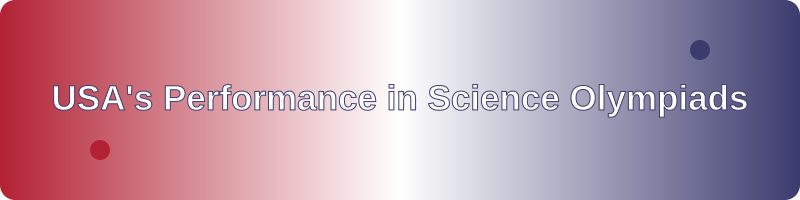
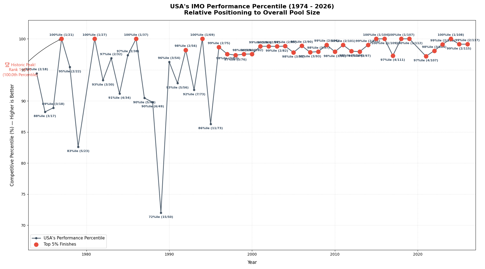
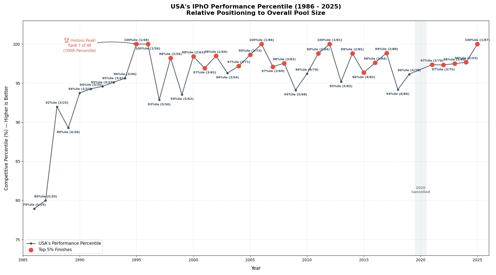
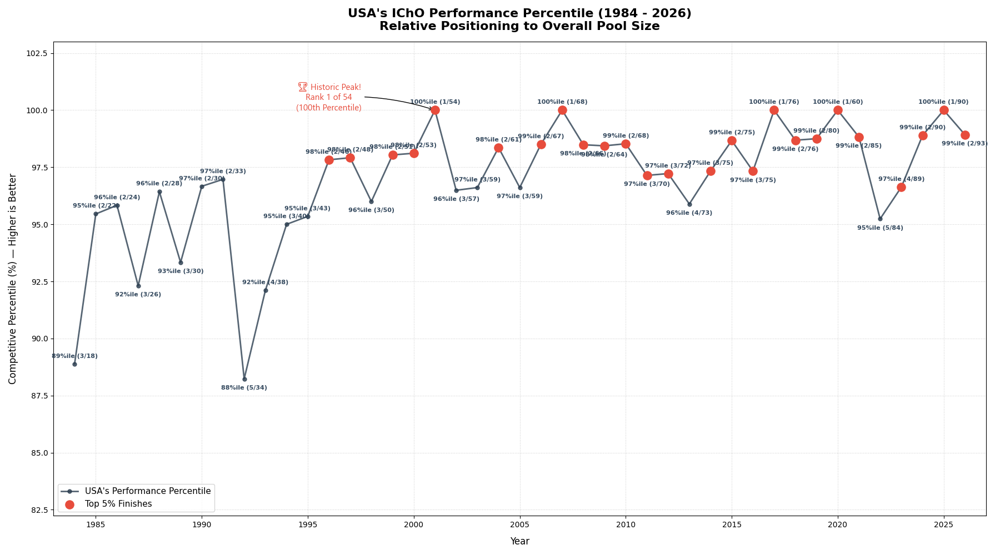
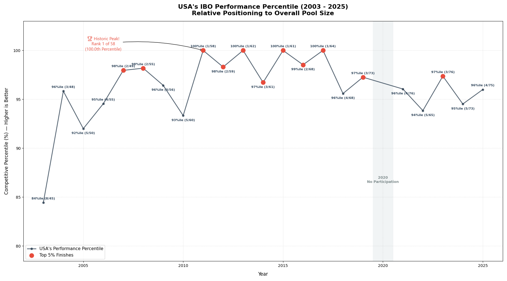
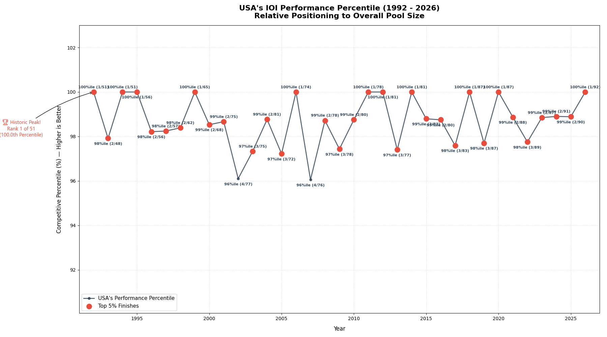
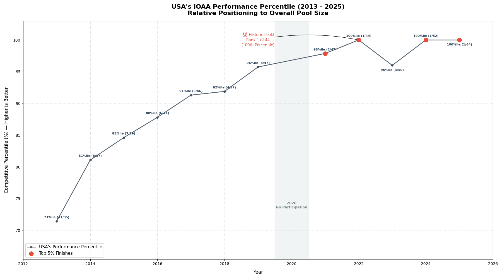

  

  
  
  
  

# 🇺🇸 USA Performance in Science Olympiads 🏅

**A comprehensive visual representation and statistical analysis of USA's performance across various International Science Olympiads.**

Discover insights, trends, and percentiles for American students in globally recognized competitions like IMO, IPhO, IChO, IBO, IOI, and IOAA. This repository serves as a data-driven overview of USA's excellence in international academics.

## 🧮 USA in International Mathematical Olympiad (IMO) Percentile

## 🔭 USA in International Physics Olympiad (IPhO) Percentile

## 🧪 USA in International Chemistry Olympiad (IChO) Percentile

## 🧬 USA in International Biology Olympiad (IBO) Percentile

## 💻 USA in International Olympiad in Informatics (IOI) Percentile

## 🌌 USA in International Olympiad on Astronomy and Astrophysics (IOAA) Percentile

# USAs_Performance_in_Science_Olympiads
